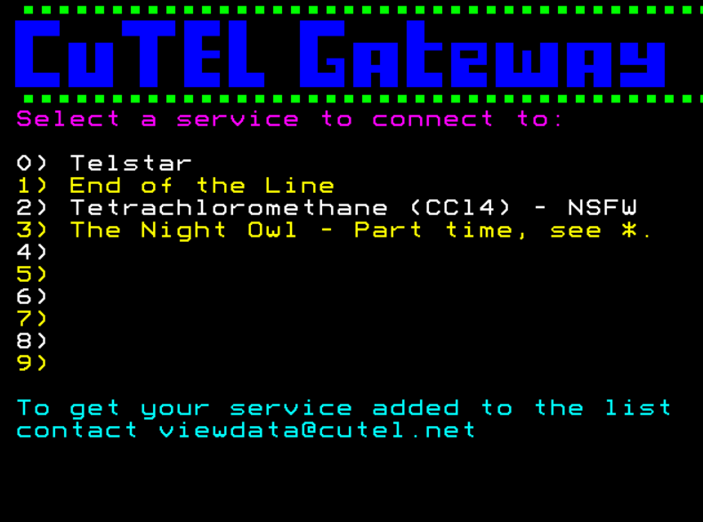

# viewdata-gateway

This is a simple and lightweight Viewdata Gateway that allows a client to connect (via TCP) and select from a list of Viewdata services.

When a client connects they're presented a customisable menu and they can select from   up to 10 viewdata services. They enter the number of the service they wish to connect to and the connection is then proxied to the service.

[Docker Hub](https://hub.docker.com/r/marrold/viewdata-gateway)
[Github](https://github.com/cu-telecom/viewdata-gateway)

## Configuration

viewdata-gateway is configured in `config.yaml` which should look something like this:

    listening_port: 6502
    menu_url: https://zxnet.co.uk/teletext/editor/#0:QIECBAgQIECBAgQIECBAgQIECBAgQIECBAgQIECBAgQIECAkoUKFChQoUKFChQoUKFChQoUKFChQoUKFChQoUKFChQoUKCn9elQIEC_-v1P0v9AgQf16VAgQf0CBAgQIECBAgQIECBAgKf0CD_qaoP6DU9Sf0CBB_wMP-tr_R6ubX_o1Nf-tr_9NUCAp_-NP_5qg_oNX1p_-IEH_41_62v_5q-tP_781_62vz81QICShQoUKFChQoUKFChQoUKFChQoUKFChQoUKFChQoUKFChQoQIECBAgQIECBAgQIECBAgQIECBAgQIECBAgQIECBAgQIECALTy7MuPogwoOeXl2048qDpvQY9-7dlx9EHTe6QIECBAgQIECBAgQIECBAgQIECBAgQIECBAgQIECBAgQIECBAgQIECBAgQMFKCpl2c-mHkgQIECBAgQIECBAgQIECBAgQIECBAgQIECAGxUoIu7Ig35kHTRlQTNO7KgQIECBAgQIECBAgQIECBAgQIEDJSgqZenLDj0bN_Lfty9NGHdlQKIcPY0UoFqCdTjV0CBAgBs1KCpoyoJ2nPo6IJ_fYgWoKGHl0QdNO3KsQc8uVAqXIECBA0UoECBAgQIECBAgQIECBAgQIECBAgQIECBAgQIECBAgQIAbVSgQIECBAgQIECBAgQIECBAgQIECBAgQIECBAgQIECBAgQNlKBAgQIECBAgQIECBAgQIECBAgQIECBAgQIECBAgQIECAG3UoECBAgQIECBAgQIECBAgQIECBAgQIECBAgQIECBAgQIEDhSgQIECBAgQIECBAgQIECBAgQIECBAgQIECBAgQIECBAgBuVKBAgQIECBAgQIECBAgQIECBAgQIECBAgQIECBAgQIECBAgQIECBAgQIECBAgQIECBAgQIECBAgQIECBAgQIECBAgQIA1Tegz5eiDzv68kHPLy7aceVBhyZMuRB03oOmjKg2aefRAgDY9-7phx9EHbTl75MPTDAx9emXYu3ZeiBAgQIECBAgQIECBAgQIECBAgQIECBAgQIECBAgQIECBAgQIECBAgQIECBAgQIECBAgQIECBAgQIECBAgQIECBAgQIECBAgQIECBAgQIECBAgQIECBAgQIECBAgQIECBAgQIECBAgQIECBAgQIECBAgQIEBI:PS=0:RE=0:zx=Ml0
    backend_servers:
      0:
        host: glasstty.com
        port: 6502
      1:
        host: endofthelinebbs.com
        port: 6502
      2:
        host: fish.ccl4.org
        port: 23
      3:
        host: nightowlbbs.ddns.net
        port: 6400

### Config Options

| Option | Description |
|--|--|
| listening_port | The TCP Port to listen on |
| menu_url | A link to a page designed in the [ZXNet](https://zxnet.co.uk/teletext/editor/) or [edit.tf](https://edit.tf/) editor |
| backend_servers | A map of the menu option and which host / port it should connect to|

### Displaying Errors

The gateway will display error text on line 22 of the menu. You should leave this space blank.

## Acknowledgements

Thanks as always to:

* John Newcombe - Created the [Telstar](https://glasstty.com/telstar/) Viewdata service and I borrowed a bit of code for parsing Viewdata frames.
* ZXGuesser - Created the [ZXNet editor](https://zxnet.co.uk/teletext/editor/)
* Simon Rawles - Created the [edit.tf editor](https://edit.tf/)

## Licence

This project is licensed under the MIT license
