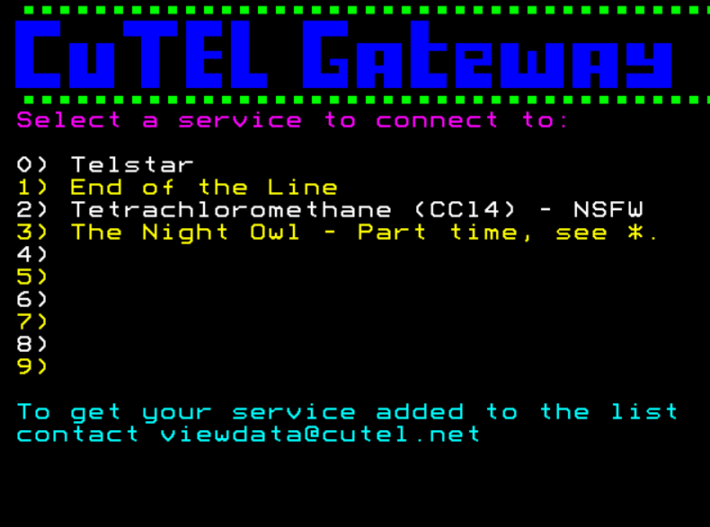

# viewdata-gateway

This is a simple and lightweight Viewdata Gateway that allows a client to connect (via TCP) and select from a list of Viewdata services.

When a client connects they're presented a customisable banner with an auto-generated, numbered list of viewdata services below it. They enter the number of the service they wish to connect to and the connection is then proxied to the service. If there are more services than fit on one screen, they're split across pages - press `#` to cycle through them.

[Docker Hub](https://hub.docker.com/r/marrold/viewdata-gateway)  
[Github](https://github.com/cu-telecom/viewdata-gateway)

## Configuration

viewdata-gateway is configured in `config.yaml` which should look something like this:

    listening_port: 6502
    max_connections: 100
    choice_timeout: 120
    banner_rows: 10
    banner_url: https://zxnet.co.uk/teletext/editor/#0:QIECBAgQIECBAgQIECBAgQIECBAgQIECBAgQIECBAgQIECAkoUKFChQoUKFChQoUKFChQoUKFChQoUKFChQoUKFChQoUKCn9elQIEC_-v1P0v9AgQf16VAgQf0CBAgQIECBAgQIECBAgKf0CD_qaoP6DU9Sf0CBB_wMP-tr_R6ubX_o1Nf-tr_9NUCAp_-NP_5qg_oNX1p_-IEH_41_62v_5q-tP_781_62vz81QICShQoUKFChQoUKFChQoUKFChQoUKFChQoUKFChQoUKFChQoQIECBAgQIECBAgQIECBAgQIECBAgQIECBAgQIECBAgQIECALTy7MuPogwoOeXl2048qDpvQY9-7dlx9EHTe6QIECBAgQIECBAgQIECBAgQIECBAgQIECBAgQIECBAgQIECBAgQIECBAgQMFKCpl2c-mHkgQIECBAgQIECBAgQIECBAgQIECBAgQIECAGxUoIu7Ig35kHTRlQTNO7KgQIECBAgQIECBAgQIECBAgQIEDJSgqZenLDj0bN_Lfty9NGHdlQKIcPY0UoFqCdTjV0CBAgBs1KCpoyoJ2nPo6IJ_fYgWoKGHl0QdNO3KsQc8uVAqXIECBA0UoECBAgQIECBAgQIECBAgQIECBAgQIECBAgQIECBAgQIAbVSgQIECBAgQIECBAgQIECBAgQIECBAgQIECBAgQIECBAgQNlKBAgQIECBAgQIECBAgQIECBAgQIECBAgQIECBAgQIECAG3UoECBAgQIECBAgQIECBAgQIECBAgQIECBAgQIECBAgQIEDhSgQIECBAgQIECBAgQIECBAgQIECBAgQIECBAgQIECBAgBuVKBAgQIECBAgQIECBAgQIECBAgQIECBAgQIECBAgQIECBAgQIECBAgQIECBAgQIECBAgQIECBAgQIECBAgQIECBAgQIA1Tegz5eiDzv68kHPLy7aceVBhyZMuRB03oOmjKg2aefRAgDY9-7phx9EHbTl75MPTDAx9emXYu3ZeiBAgQIECBAgQIECBAgQIECBAgQIECBAgQIECBAgQIECBAgQIECBAgQIECBAgQIECBAgQIECBAgQIECBAgQIECBAgQIECBAgQIECBAgQIECBAgQIECBAgQIECBAgQIECBAgQIECBAgQIECBAgQIECBAgQIEBI:PS=0:RE=0:zx=Ml0
    backend_servers:
      - name: GlassTTY
        host: glasstty.com
        port: 6502
      - name: End of the Line BBS
        host: endofthelinebbs.com
        port: 6502
      - name: Fish BBS
        host: fish.ccl4.org
        port: 23
      - name: Night Owl BBS
        host: nightowlbbs.ddns.net
        port: 6400

### Config Options

| Option | Description |
|--|--|
| listening_port | The TCP Port to listen on |
| max_connections | Maximum number of clients that may be connected at once. Optional, defaults to 100 |
| choice_timeout | Seconds a connected client has to pick a menu option before being disconnected. Optional, defaults to 120 |
| banner_rows | Number of rows (from the top) the banner occupies. The rest of the page (down to row 21) is used for the auto-generated backend list, and row 22 is always reserved for status messages. Optional, defaults to 10 |
| banner_url | A link to a page designed in the [ZXNet](https://zxnet.co.uk/teletext/editor/) or [edit.tf](https://edit.tf/) editor. Only the top `banner_rows` rows are used - design it as a logo/header and leave the rest blank |
| backend_servers | A list of viewdata/BBS services to offer. Each needs a `name` (shown in the auto-generated list), `host`, and `port`. Up to 10 are shown per page, digit-labelled in the order given; if there are more, a "# More options" footer appears and pressing `#` cycles through the remaining pages |

### Displaying Errors

The gateway displays status/error text on row 22 - this is always reserved and doesn't need to be left blank in your banner design, since only the first `banner_rows` rows of it are ever used.

## Acknowledgements

Thanks as always to:

* John Newcombe - Created the [Telstar](https://glasstty.com/telstar/) Viewdata service and I borrowed a bit of code for parsing Viewdata frames.
* ZXGuesser - Created the [ZXNet editor](https://zxnet.co.uk/teletext/editor/)
* Simon Rawles - Created the [edit.tf editor](https://edit.tf/)

## Licence

This project is licensed under the MIT license
